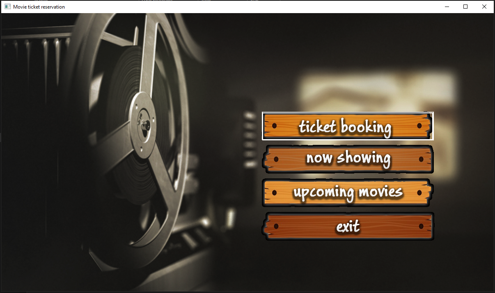
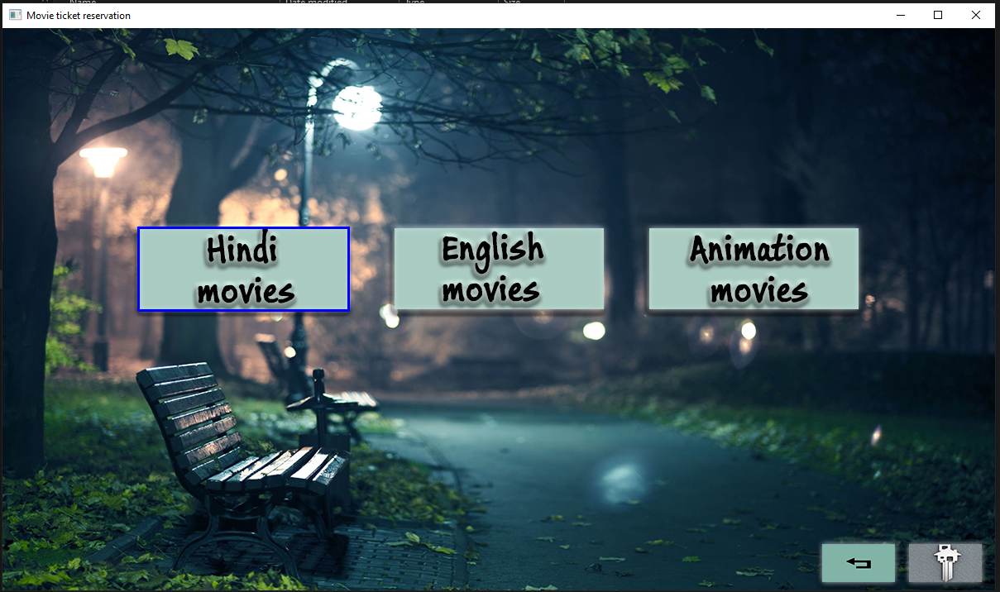
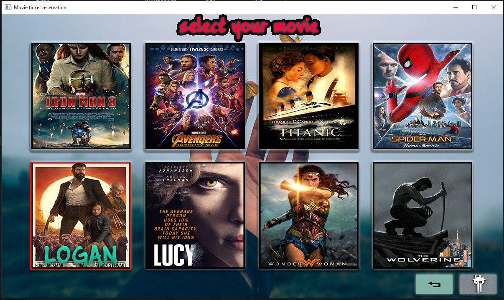
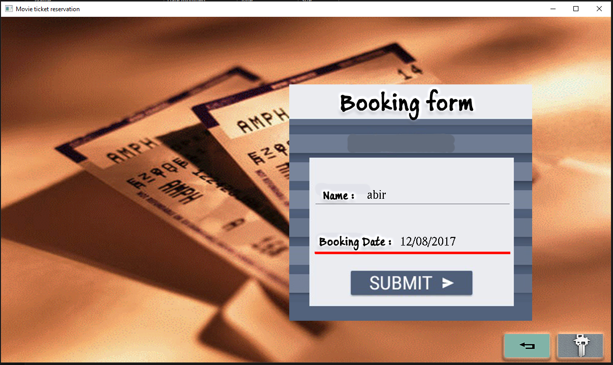
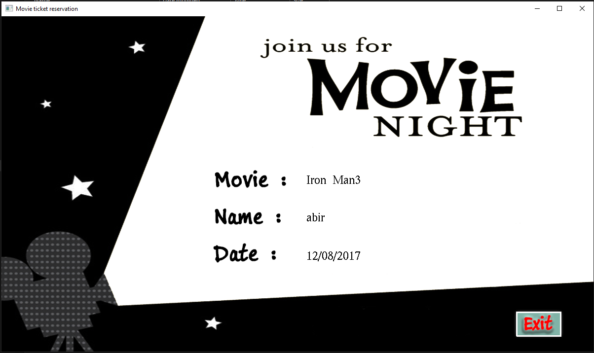

# Movie_Ticket
This is a mini project to replicate a website. But back then I only knew html(lol). 

## Project description
Name: Movie Ticket  
Programming Language: C & C++  
GUI: iGraphics
Project No: 6  
Year: late 2017

## Demo Video

## Screen shot
### Homescreen
 

### Movie Selection
 

### Window
 

 

### Booking info
 

## Authors

* **AbirHasan**

Check out my other works [@XAbirHasan](https://github.com/XAbirHasan)